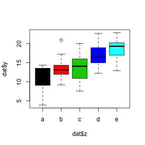
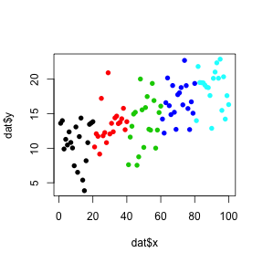
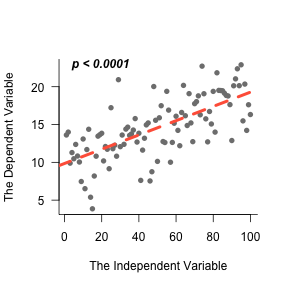
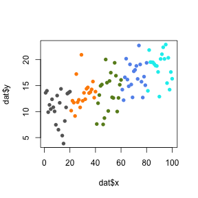
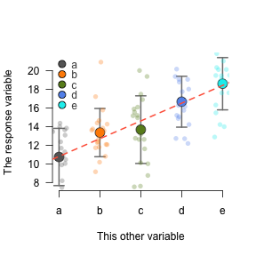

# RmarkdownDemo

## Configure

If you want to beautify your output, it always starts here. 
There are many options, and a few are laid out below. 
The `knitr` package has lots of options explained 
[here](http://yihui.name/knitr/options#chunk_options) and 
[here](http://kbroman.org/knitr_knutshell/pages/Rmarkdown.html) in detail. 

Part of configuring your script is loading the correct packages. 
Always load all packages together at the top. 
That way future users will know exactly what they need to install. 


```r
library(scales)
library(knitr)
opts_chunk$set(background='gray80', tidy=FALSE, cache=FALSE, comment='',
               dpi=72, fig.path='RMDfigs/', fig.width=4, fig.height=4)
```


If you ever want someone else to be able to perfectly reproduce your results, always set the random seed at the top. 
Any number will do. Note that it never hurts to set the seed, *but* robust results should always stand up to random number generators. 


```r
set.seed(1415)
```


## Generate fake data

The `x` value is just numbers 1-100 for an x axis value. 
This might be time or distance, etc.  
For the response variable, generate a random normal distribution with the `rnorm` function, 
and then add a trend with the `seq` function. 
Then we'll add some fake treatments with `letters`. 


```r
# setwd('~/Desktop')

x <- 1:100
y <- rnorm(100, sd=3) + seq(10.05, 20, 10/100)
z <- factor(rep(letters[1:5], each=20))
dat <- data.frame(x, y, z)
```


## Tables in `knitr`

This is an ugly way to preview data or display tables. 


```r
head(dat)
```

```
  x        y z
1 1 13.61478 a
2 2 13.99715 a
3 3  9.89061 a
4 4 11.28953 a
5 5 10.47271 a
6 6 12.36858 a
```


The `knitr` package has a simple built-in function for dealing with tables. 
This works well in either html or pdf output. 


```r
kable(head(dat))
```


  x          y  z  
---  ---------  ---
  1   13.61478  a  
  2   13.99715  a  
  3    9.89061  a  
  4   11.28953  a  
  5   10.47271  a  
  6   12.36858  a  


<!-- This is a comment in html, which is a great way to include comments in an Rmarkdown document. 
The following two code chunks are also hidden - because of the 'echo=FALSE' command. 
The code is also not evaluated in R - notice the 'eval=FALSE' command. --> 


```r
# remove a few samples that we don't want to analyze. 
# dat <- dat[-c(3, 4, 5, 12), ]
```


## R commands embedded in prose

One of the best features in `knitr` and Rmarkdown generally, is the ability to embed real R commands in sentences, so that you can report actual values instead of constantly copying and pasting when results change a little bit. 

This table has 100 rows and 3 columns. The 'x' variable starts at 1 and ends at 100. 

0.0596705

## Explore the data

Plot the data - a trend emerges! Here are several ways to look at the data. 

1. The rough R default
2. boxplots using the factors
3. points with default colors
4. same colors but with nicer plotting characters (`pch`)


```r
plot(dat$y ~ dat$x)
```

 

```r
plot(dat$y ~ dat$z, col=unique(dat$z))
```

 

```r
plot(dat$y ~ dat$x, col=dat$z)
```

 

```r
plot(dat$y ~ dat$x, col=dat$z, pch=16)
```

 


## Linear models

Let's see if the linear and grouped trends are significant using a linear model. The model can be stored, and then we can pull out pieces as the analysis progresses. 


```r
lm.xy <- lm(y ~ x, data=dat)
lm.zy <- lm(y ~ z, data=dat)

kable(summary(lm.xy)$coefficients)
```

                Estimate   Std. Error    t value   Pr(>|t|)
------------  ----------  -----------  ---------  ---------
(Intercept)    9.8492584    0.5970717   16.49594          0
x              0.0943083    0.0102646    9.18769          0

```r
kable(summary(lm.zy)$coefficients)
```

                Estimate   Std. Error     t value    Pr(>|t|)
------------  ----------  -----------  ----------  ----------
(Intercept)    10.741143    0.6682720   16.073011   0.0000000
zb              2.618026    0.9450793    2.770166   0.0067394
zc              2.934843    0.9450793    3.105394   0.0025049
zd              5.934905    0.9450793    6.279796   0.0000000
ze              7.865640    0.9450793    8.322729   0.0000000

Since we have a clear pattern, plot the line we just modeled. 


```r
plot(dat$y ~ dat$x, pch=16, col='gray50', 
     las=1, bty='l', 
     xlab='The Independent Variable', 
     ylab='The Dependent Variable')
abline(lm.xy, col='tomato', lwd=4, lty=2)
pval <- summary(lm.xy)$coefficients[8]
text(0, max(dat$y), 'p < 0.0001', font=4, pos=4)
```

 

Much better. 


## Improve the plots

Default R colors are useful but not that aesthetic. So we can assign them however we want to. Assigning them to the same dataframe keeps all data points lined up perfectly. ***R does not line up your data automatically!! You have to make sure everything is lined up before you can trust results!!***


```r
dat$col <- 'gray40'
dat$col[dat$z == 'b'] <- 'darkorange'
dat$col[dat$z == 'c'] <- 'olivedrab4'
dat$col[dat$z == 'd'] <- 'cornflowerblue'
dat$col[dat$z == 'e'] <- 'cyan2'
colors5 <- unique(dat$col)
```


And check the new colors. Note they are now a bit more colorblind-proof. 


```r
plot(dat$y ~ dat$x, col=dat$col, pch=16)
```

 


## Aggregate data across treatments

The linear model created above was ok for `x` vs `y`. 
However, what if we want to take advantage of groups instead of just the simple linear relationship?  
Let's create a dataset that combines data from each group (a, b, c, d, e). The `aggregate` function is perfect. 

Also, R does not have a default fuction for standard error, so we'll create one. Creating functions in R is pretty simple, and becomes mandatory anytime you are going to repeat lines of code over and over. 


```r
se <- function(a) {
  sd(a)/sqrt(length(a))
  }
```


First, create an empty data frame, and then fill in the row and column names. 
Next fill in the columns with the `aggregate` function. 


```r
grouped <- data.frame(matrix(0, nrow=nlevels(dat$z), ncol=3))
names(grouped) <- c('mean', 'sd', 'se')
row.names(grouped) <- levels(dat$z)
grouped$mean <- aggregate(dat$y, by=list(dat$z), FUN='mean')$x
grouped$sd <- aggregate(dat$y, by=list(dat$z), FUN='sd')$x
grouped$se <- aggregate(dat$y, by=list(dat$z), FUN='se')$x
kable(grouped)
```

          mean         sd          se
---  ---------  ---------  ----------
a     10.74114   3.072380   0.6870050
b     13.35917   2.589104   0.5789414
c     13.67599   3.631762   0.8120866
d     16.67605   2.730877   0.6106427
e     18.60678   2.805064   0.6272314


Create a simple model that now takes advantage of the replicated regression study design. 


```r
lm.RepReg <- lm(y ~ as.numeric(z), data=dat)
kable(summary(lm.RepReg)$coefficients)
```

                 Estimate   Std. Error     t value   Pr(>|t|)
--------------  ---------  -----------  ----------  ---------
(Intercept)      8.897379    0.7010884   12.690809          0
as.numeric(z)    1.904816    0.2113861    9.011074          0


Plot the data showing error bars (or standard deviation bars in this example). 

* The `arrows` function is one of the easiest way to create error bars. 
* After the error bars are in place, plot the colored points on top. 
* Then show the semitransparent individual points to give a nice sense of the distribution. 
* Plot the modeled line. 
* Finally put a legend in the top corner. Legends can be tricky, and require lots of checking to make sure the points, labels, and colors are all perfectly lined up the way they should be. However, Edward Tufte might suggest that we cut the legend altogether and instead label the plot itself. So in that spirit add an axis that gives the same information. The legend is left for instructive purposes. 


```r
y.lim <- c(min(grouped$mean - grouped$sd), 
           max(grouped$mean + grouped$sd))
plot(grouped$mean ~ c(1:5), type='n', 
     ylim=y.lim, las=1, bty='n', 
     xlab = 'This other variable', xaxt='n', 
     ylab = 'The response variable')
arrows(x0 = c(1:5), y0 = grouped$mean + grouped$sd, 
       x1 = c(1:5), y1 = grouped$mean - grouped$sd, 
       col='gray50', angle=90, code=3, length=0.08, lwd=2)
points(grouped$mean ~ c(1:5), 
       pch=21, bg=colors5, col='gray20', cex=2)
points(dat$y ~ jitter(as.numeric(dat$z)), 
       col=alpha(dat$col, alpha=.3), pch=16)
abline(lm.RepReg, col='tomato', lty=2, lwd=2)
legend('topleft', 
       legend=row.names(grouped), 
       pt.bg=colors5, pch=21, pt.cex=1.5, 
       bty='n', text.col='gray30', y.intersp=.8)       
axis(side=1, at=c(1:5), labels=row.names(grouped))
```

 


